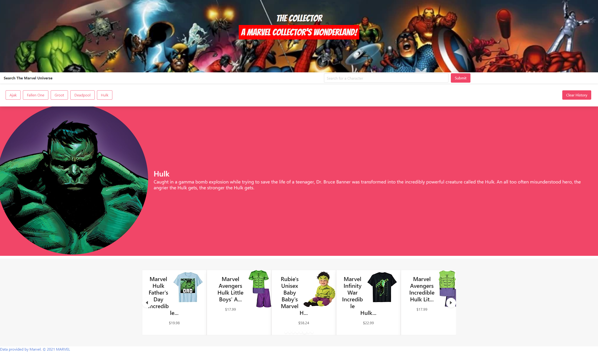

# The-Collector
A Marvel Collecters Wonderland!

## Description
Have you ever wanted to explore the Marvel universe, but don’t know where to start? Do you want to start, or grow, your Marvel collection? Well you're in luck! Our application allows you to find new characters and story lines at your fingertips! Simply search for your favorite Marvel characters to see their picture, read their Bio, and learn more about their comic appearances! After searching a character, you will also be presented with popular character merchandise, courtesy of Amazon. You can save your searched characters so you can revisit them any time! If you want to explore different characters, let our search autocomplete suggest new characters for you!


[Deployed Application](https://michellecoder.github.io/The-Collector)

[GitHub Repo](https://github.com/michellecoder/The-Collector)

## Technologies used
Built in Visual Studio with:
* Marvel API
* Amazon Price API
* Javascript / jQuery
* CSS / Bulma.io
* HTML

## How to
When the application is loaded, enter a character in the search bar. The search bar autocomplete function will help users explore new characters & ensure accurate spelling of character names. Pressing the 'Submit' button will call both the Marvel API & Amazon Price API for the selected character. A character picture, biography data (if available), comic data, and links to the character wiki & comic pages are displayed to the page. A carousel of popular character merchandise, available for purchase from Amazon, is displayed below the character info section. The searched character is added to local storage and displayed as a searchable button below the search bar. The user can press the button of a previously searched character to recall that characer's information. Pressing the 'Clear History' button will clear all previously searched characters from local storage and remove all searchable character buttons from the page.



## User Story
Given the following user stories:

```
AS A fan of the Marvel franchise
I WANT TO search for my favorite characters
SO THAT I can purchase fan gear & merchandise
```
```
AS A superhero fan
I WANT TO find merchandise that includes my favorite heros
SO THAT I can grow my physical collection
```

## Acceptance Criteria
Given the following acceptance criteria:

```
GIVEN a landing page with a form input
WHEN I search for a character
THEN I am presented with a character picture, biography data, and merchandise available for purchase.
WHEN I view character biography data
THEN I am presented with a character description, comic information & clickable links to the character wiki & comic pages.
WHEN I view the merchandise section
THEN I am presented with a title, price tag, picture, and clickable link to different pieces of merchandise.
WHEN I search for a character
THEN that character is added to the search history
WHEN I click on a character in the search history
THEN I am again presented with a character picture, biography data, and merchandise available for purchase.
```

## Contact The Dev Team
Adrian Cronin: [AdrianCronin](https://github.com/AdrianCronin)

Consolata Njeri: [Conso97](https://github.com/Conso97)

Joseph Pruitt: [j92pruitt](https://github.com/j92pruitt)

Michelle Oakley: [michellecoder](https://github.com/michellecoder)

Sam Preston: [spreston4](https://github.com/spreston4)
